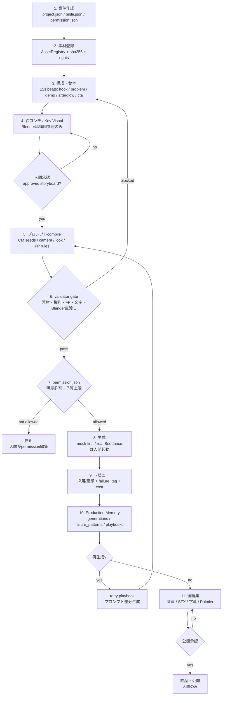
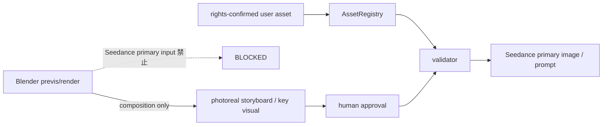
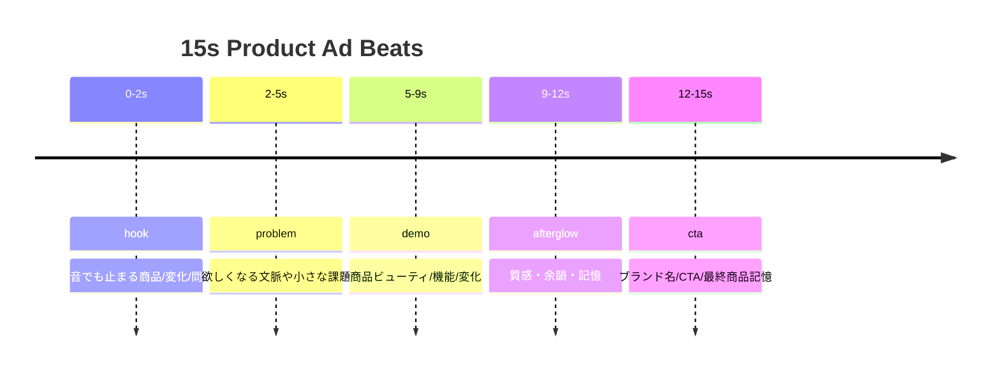

# Studio v2 Workflow Visual

このツールの正規制作ラインは Studio v2 です。v1 Factory UI / `workspace/` は凍結された参照・過去ログ扱いです。

## 全体フロー

## 入力できるもの / できないもの

## ゲート一覧

| Gate | 目的 | 止めるもの | 証拠 |
|---|---|---|---|
| AssetRegistry | 素材の出自と権利を固定 | 権利不明、実在顔、sha不一致 | `assets/registry.jsonl` |
| Storyboard approval | 画作りの正を人間確認 | 未承認Key Visual | `approvals.jsonl` |
| Contract validator | 既知失敗を生成前に止める | FP-001〜008、Blender直渡し、文字生成依存 | `studio/core/contract_validator.py` |
| Permission | 有料生成の最終ロック | 明示許可なし、予算超過 | `permission.json` |
| Review | 出力の採用/棄却を記録 | 薄い動画の再利用 | `ProductionMemory` |

## 15秒CMの標準ビート

## 運用ルール

- Codexは有料生成・MCP実行・外部投稿をしない。
- 本番生成は人間が `permission.json` を編集してから実行する。
- 初回は完成CMではなく、1ショット4〜5秒のスモークテストだけ。
- 字幕、正確な日本語テロップ、最終タイトルは後編集。
- 失敗は `failure_tag` としてMemoryに残し、次回compile/validator/retryへ戻す。

