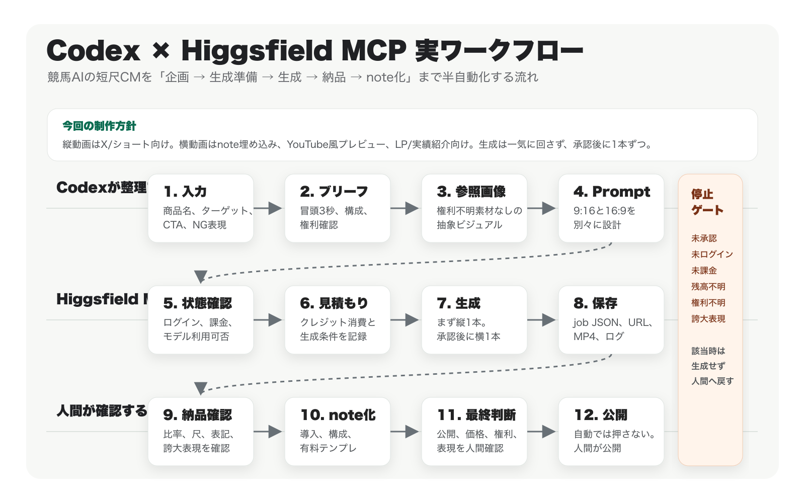

# Codex × Higgsfield MCPで、AI CM制作を半自動化する方法

AI動画生成は、もう「プロンプトを入れたら映像が出る」段階まで来ています。

ただ、商用に近い短尺CMを作るときに本当に面倒なのは、動画生成そのものだけではありません。

- 何を宣伝するのか
- 誰に見せるのか
- 冒頭3秒で何を見せるのか
- 縦動画と横動画で何を変えるのか
- どこまで言ってよくて、何を言ってはいけないのか
- 生成コストと再生成回数をどう管理するのか
- 生成後に何をチェックして納品するのか
- その制作過程をどうnote記事にするのか

このあたりを毎回その場で考えると、AI動画生成はすぐに散らかります。

そこで今回は、CodexとHiggsfield MCPを使って、短尺CM制作の企画、参照画像、Seedanceプロンプト、MCP実行準備、納品チェック、note記事化までを半自動化する流れを作りました。

先に大事なことを書いておくと、Higgsfield / Seedanceで実際に動画を生成するには、Higgsfieldの課金アカウントと利用可能なクレジットが必要です。

ただし、この記事で紹介するようなブリーフ作成、プロンプト作成、note下書き作成、納品チェックリスト作成までは、Higgsfield課金前でも準備できます。

この記事では「AIなら完全自動で商用公開できる」とは言いません。

むしろ逆で、AI生成を仕事で使うなら、止める場所、確認する場所、人間が判断する場所を先に決めておくのが大事です。

## 今回作るもの

今回の題材は、競馬AIというサービスのCMです。

ターゲットはXの競馬ユーザー。

狙いは、タイムラインで流れてきたときに「AIでここまで綺麗なCMを作れるのか」と思ってもらうことです。

最後は「フジ AI開発」を印象に残す構成にします。

今回は2つの動画枠を用意します。

1. 9:16の縦動画  
X、ショート動画、スマホ閲覧向け。冒頭3秒で止めるためのCM。

2. 16:9の横動画  
note記事内の埋め込み、YouTube風プレビュー、LP、制作実績紹介向け。世界観を広く見せるCM。

### 縦動画の差し込み枠

> ここにHiggsfield / Seedanceで生成した9:16 CMを後で埋め込みます。  
> 想定保存先: `workspace/outputs/final-cm-9x16-v1.mp4`

### 横動画の差し込み枠

> ここにHiggsfield / Seedanceで生成した16:9 CMを後で埋め込みます。  
> 想定保存先: `workspace/outputs/final-cm-16x9-v1.mp4`

## 実際のワークフロー図

今回の流れを図にすると、こうなります。



この図で重要なのは、動画生成をいきなり始めないことです。

最初にCodexでブリーフ、権利確認、プロンプト、縦横の使い分け、停止条件を決めます。

そのあとHiggsfield MCPでアカウント状態、モデル利用可否、コスト見積もりを確認します。

未ログイン、未課金、クレジット不足、プロンプト未承認、権利不明素材あり、誇大表現ありの場合は、そこで止めます。

この「止まる設計」が、商用に近いAI制作ではかなり重要です。

## AI動画生成だけでは足りない理由

AI動画生成は便利ですが、CM制作として見ると、生成ボタンを押す前後に必要な作業がかなりあります。

たとえば、次のような問題が起きやすいです。

- 商品名やサービス名の表記が途中でぶれる
- 読み方や発音がプロンプトに入っていない
- 9:16と16:9を同じプロンプトで作ってしまい、構図が崩れる
- 画面内テキストが長すぎて読めない
- 生成回数が増えて予算が膨らむ
- 権利不明の画像やロゴを使ってしまう
- 根拠のない「No.1」「必ず勝てる」「必ず集客できる」のような表現が混ざる
- 生成ログやジョブ情報が残らない
- 納品前チェックが属人的になる
- note記事にしたとき、何を無料で見せて何を有料にするか決まっていない

特に商用に近いCMでは、見た目の派手さだけで進めると危険です。

AIに任せる部分と、人間が確認する部分を分けておく必要があります。

## Codexに任せる部分

今回、Codex側で自動化するのは、主に制作管理と文章化です。

- 入力テンプレート作成
- 不足情報チェック
- CMブリーフ作成
- 9:16用Seedanceプロンプト作成
- 16:9用Seedanceプロンプト作成
- 参照画像プロンプト作成
- Higgsfield MCP用リクエストJSON作成
- コスト見積もりログの保存準備
- 生成ジョブ情報の保存準備
- 納品前チェックリスト作成
- note記事下書き作成
- note風HTMLプレビュー作成
- 既知の制約・注意事項の整理

Higgsfield / Seedanceは映像生成を担当します。

Codexは、その前後の段取りを整える役です。

## Higgsfield MCPでやる部分

Higgsfield MCP側でやるのは、実際のアカウント確認、モデル確認、コスト見積もり、動画生成です。

この段階では、Higgsfieldへのログイン、課金状態、Seedanceを使えるクレジットが必要になります。

未ログイン、未課金、クレジット不足の場合は、そこで止めます。

勝手に課金したり、無制限に再生成したりはしません。

今回のルールはこうです。

- 原則モデルは `seedance_2_0`
- まずは縦動画を1本生成
- 縦動画を確認してから横動画を1本生成
- 再生成は各フォーマット原則2回まで
- 予算やクレジットが不明なら、最小構成で止める
- note公開ボタンは押さない
- 有料設定や価格設定は人間が決める

## 縦動画と横動画で何を変えるのか

縦動画と横動画は、同じCMでも役割が違います。

| 項目 | 9:16 縦動画 | 16:9 横動画 |
| --- | --- | --- |
| 主な用途 | X、ショート動画、スマホ閲覧 | note埋め込み、YouTube風プレビュー、LP、実績紹介 |
| 最初の目的 | スクロールを止める | 世界観と制作力を見せる |
| 構図 | 中央に被写体、上下に短い文字 | 左右に余白、横方向に情報を展開 |
| テキスト | 1画面1フレーズ | 画面端に余白を残して短く配置 |
| 注意点 | 小さい文字を入れない | 縦用プロンプトを流用しない |

縦動画では、スマホ画面で一瞬見たときのインパクトが重要です。

横動画では、note記事の中で「こういう映像まで作れる」という実績として見せやすいことが重要です。

つまり、同じサービスを扱っていても、プロンプトは分けたほうがいいです。

## 今回のCMブリーフ

今回の競馬AI CMでは、以下のようにブリーフを固定しました。

- 商品名 / サービス名: 競馬AI
- 読み方: けいばエーアイ
- ターゲット: Xの競馬ユーザー
- 目的: AIでここまで綺麗なCMを作れるのかと驚いてもらう
- 表現方針: 未来的な競馬データ分析、光のレーストラック、AIパネル
- CTA: フジ AI開発
- フォーマット: 9:16と16:9
- 尺: 15秒
- 生成本数: まず縦1本。承認後に横1本
- 再生成上限: 各フォーマット原則2回まで
- 素材: ユーザー提供素材なし。抽象的な生成ビジュアルを使う

注意したのは、競馬AIだからといって、的中保証や利益保証のように見せないことです。

「必ず勝てる」「回収率が上がる」「勝率No.1」のような表現は、根拠なしには入れません。

また、実在の競馬場、実在馬、実在騎手、第三者ロゴ、Web上の権利不明素材も使いません。

抽象的なAI競馬分析ビジュアルとして見せます。

## 参照画像の考え方

素材がない場合、image-to-video用の参照画像を作ります。

ただし、Web上の競馬場写真や馬の写真を勝手に使うのではなく、権利不明素材なしの抽象ビジュアルにします。

今回の参照画像では、以下だけを使います。

- 光のレーストラック
- 抽象的な馬のシルエット
- AIデータパネル
- 競馬AI
- フジ AI開発

逆に、以下は避けます。

- 実在競馬場
- 実在馬
- 実在騎手
- 競馬団体や第三者ブランドのロゴ
- 馬券、札束、カジノ的な表現
- 的中保証や利益保証に見える表現

参照画像はCMの世界観を決めるだけで、商用公開前には人間が必ず確認します。

## Seedance用プロンプトの考え方

9:16の短尺CMでは、情報を詰め込みすぎないほうがよいです。

今回の縦動画プロンプトは、次の4場面で作りました。

1. 0-3秒: 光の競馬場と「競馬AI」
2. 3-7秒: AI分析パネルとデータ粒子
3. 7-11秒: Xで思わず止まるような縦型CM表現
4. 11-15秒: 「フジ AI開発」で締める

画面内テキストは、このくらいに絞ります。

- 競馬AI
- AIで、競馬を美しく
- 予想を、データで見る
- フジ AI開発

長文テロップは入れません。

16:9では、同じフレーズを使いながら、カメラと配置を変えます。

- 左から右へ走る光のレーストラック
- 左右に広がるAI分析パネル
- ワイド画面の中央に馬のシルエット
- 最後はnoteやYouTubeのカバーにも使える余白のあるブランドフレーム

## 実行前に止めるべきポイント

このワークフローでは、生成前に必ず止めるポイントを作っています。

- CM内容が未承認なら止める
- プロンプトがproposal状態なら止める
- Higgsfieldに未ログインなら止める
- 課金状態やクレジットが確認できないなら止める
- コスト見積もり前なら止める
- 権利不明素材があるなら止める
- note公開前は必ず人間が確認する

AI制作は自動化できます。

ただし、何でも自動で進めると事故ります。

だから「進める手順」だけでなく、「止める条件」もテンプレート化します。

## 実際に作られるファイル

今回のワークフローでは、以下のようなファイルを作ります。

```text
workspace/
  inputs/
    project-brief.md
  assets/
    reference-keiba-ai-v1.png
    workflow-diagram-v1.svg
    workflow-diagram-v1.png
  briefs/
    cm-brief.md
  prompts/
    seedance-9x16-v1.txt
    seedance-16x9-v1.txt
  outputs/
    final-cm-9x16-v1.mp4
    final-cm-16x9-v1.mp4
  note/
    note-ready-draft-v1.md
    note-preview.html
    note-structure.md
  logs/
    cost-estimate-9x16.json
    cost-estimate-16x9.json
    job-9x16-v1.json
    job-16x9-v1.json
  delivery/
    pre-delivery-check.md
    final-report.md
```

実際の動画生成前でも、プロンプト、ブリーフ、note下書き、図解、チェックリストまでは作れます。

## 納品前チェック

生成後は、最低限これを確認します。

- 動画が開けるか
- 9:16または16:9になっているか
- 尺が合っているか
- 商品名が正しいか
- 読み方指定が反映されているか
- 画面内テキストが長すぎないか
- 的中保証、利益保証、誇大広告表現がないか
- 権利不明素材が混ざっていないか
- 縦動画と横動画の役割が分かれているか
- 生成ログが残っているか
- known limitationsが書かれているか

生成AIの動画は、文字、ロゴ、細部、人物、商品形状が崩れることがあります。

そのため、最終公開前の確認は人間が行います。

## note記事化まで自動化する意味

AI CMを作るだけなら、動画ファイルを出して終わりです。

でも、制作過程をnote化できると、次の価値が出ます。

- 制作実績として見せられる
- どんなワークフローで作ったか説明できる
- 有料部分でテンプレートを販売できる
- 次の案件で同じ型を再利用できる
- 失敗した生成や制約も記録として残せる

今回のnoteでは、無料部分で全体像と注意点を見せます。

有料部分では、実案件で使えるテンプレートを渡します。

## 無料部分で見せる内容

無料部分では、次の内容を出します。

- 何ができるか
- 縦動画と横動画の使い分け
- 実ワークフロー図
- Higgsfield課金が必要なタイミング
- CM制作で止めるべきポイント
- 権利不明素材を使わない考え方
- 納品前チェックの全体像

無料部分だけでも「こういう流れで作るのか」は分かるようにします。

## 有料部分で渡すもの

有料部分では、実案件で使いやすいテンプレートをまとめます。

1. Codexに投げるマスタープロンプト
2. CMブリーフテンプレート
3. 参照画像プロンプトテンプレート
4. 9:16 Seedanceプロンプトテンプレート
5. 16:9 Seedanceプロンプトテンプレート
6. Higgsfield MCP実行前チェックリスト
7. 縦横動画の生成順序
8. 納品前チェックリスト
9. note記事化テンプレート
10. 実案件用ヒアリングシート

---

ここから先は有料部分の想定構成です。

## Codexに投げるマスタープロンプト

以下のような指示をCodexに渡すと、商品情報からCM制作パッケージまで作れます。

```text
あなたは、Codex上で動く制作自動化エージェントです。

ユーザーの商品・サービス情報から、Higgsfield MCP / Seedance用の短尺CM制作ワークフローを作ってください。

必ず以下を作成してください。

- 入力テンプレート
- CMブリーフ
- 参照画像プロンプト
- 9:16 Seedance用プロンプト
- 16:9 Seedance用プロンプト
- Higgsfield MCP実行前チェック
- コスト見積もり記録
- 生成ジョブ記録
- 納品前チェック
- known limitations
- note記事下書き
- note風プレビュー

ルール:
- noteは公開しない
- Higgsfield生成はユーザー承認後
- 課金状態とクレジット確認前に生成しない
- 権利不明素材を商用CMに使わない
- 売上保証、利益保証、No.1、公式提携を根拠なしに入れない
- 縦動画と横動画のプロンプトを分ける
- まず1本だけ生成する
- 再生成は原則2回まで
```

## CMブリーフテンプレート

```md
# CM Brief

- 商品名 / サービス名:
- 読み方:
- 一言価値提案:
- ターゲット:
- 動画の目的:
- CTA:
- 希望フォーマット:
  - 9:16:
  - 16:9:
- 尺:
- 生成本数:
- 予算上限:
- 再生成上限:
- AI音声の可否:
- 画面内テキストの可否:
- 商用利用予定:
- 利用可能な素材:
- NG表現:
- 根拠のある主張:

## 冒頭3秒

## 9:16の構成

## 16:9の構成

## 画面内テキスト

## ナレーション案

## 権利確認メモ

## 生成予算メモ

## 納品チェック項目
```

## 参照画像プロンプトテンプレート

```text
Create a polished reference image for image-to-video generation.

Use case:
AI commercial reference image.

Service:
{service_name}

Developer / brand text:
{developer_name}

Scene:
{abstract_scene_description}

Style:
Premium cinematic AI commercial, clean lighting, no real third-party brand assets.

Text:
Use only "{service_name}" and "{developer_name}".

Avoid:
- real logos
- real people or celebrities
- existing characters
- unlicensed web assets
- guarantee claims
- fake awards
- fake official partnerships
```

## 9:16 Seedanceプロンプトテンプレート

```text
Create a {duration}-second vertical 9:16 commercial video for:
"{product_or_service_name}"
Pronunciation guide: "{pronunciation}".

Audience:
{target_audience}

Objective:
{video_objective}

Format:
9:16 vertical mobile commercial, {duration} seconds, {audio_policy}, clean readable Japanese text, centered subject, fast hook.

Opening shot, 0-3 seconds:
{opening_hook}
On-screen text: "{short_hook_text}"

Middle beat, 3-7 seconds:
{middle_beat_1}
On-screen text: "{short_text_1}"

Middle beat, 7-11 seconds:
{middle_beat_2}
On-screen text: "{short_text_2}"

Ending beat, 11-15 seconds:
{ending_beat}
Final on-screen text: "{brand_text}"
CTA text: "{cta_text}"

Avoid:
- unsupported claims
- unlicensed logos or third-party assets
- celebrities or existing characters
- dense unreadable text
- guaranteed sales, profit, hit rate, or official partnership claims
```

## 16:9 Seedanceプロンプトテンプレート

```text
Create a {duration}-second landscape 16:9 commercial video for:
"{product_or_service_name}"
Pronunciation guide: "{pronunciation}".

Audience:
{target_audience}

Objective:
{video_objective}

Format:
16:9 landscape commercial, {duration} seconds, {audio_policy}, cinematic wide framing, clean readable Japanese text.

Opening shot, 0-3 seconds:
Recompose the concept for a wide frame. Use left-to-right depth, wide negative space, and a strong brand-safe area.
On-screen text: "{short_hook_text}"

Middle beat, 3-7 seconds:
{middle_beat_1_for_wide_frame}
On-screen text: "{short_text_1}"

Middle beat, 7-11 seconds:
{middle_beat_2_for_wide_frame}
On-screen text: "{short_text_2}"

Ending beat, 11-15 seconds:
Resolve into a clean wide brand frame that can work as a note or YouTube-style cover.
Final on-screen text: "{brand_text}"
CTA text: "{cta_text}"

Avoid:
- unsupported claims
- unlicensed logos or third-party assets
- celebrities or existing characters
- dense unreadable text
- guaranteed sales, profit, hit rate, or official partnership claims
```

## Higgsfield MCP実行前チェックリスト

```md
# Higgsfield MCP実行前チェック

- [ ] Higgsfieldにログイン済み
- [ ] 課金状態または利用可能クレジットを確認済み
- [ ] seedance_2_0 が使える
- [ ] 生成する本数が決まっている
- [ ] 予算上限が決まっている
- [ ] 再生成上限が決まっている
- [ ] プロンプトから proposal / pending / do not run を外した
- [ ] 参照画像の権利確認が済んでいる
- [ ] 誇大広告表現がない
- [ ] まず縦1本だけ生成する
- [ ] 横動画は縦動画確認後に生成する
```

## 縦横動画の生成順序

```text
1. 9:16用プロンプトを承認する
2. 9:16のコスト見積もりを取る
3. 9:16を1本生成する
4. 表記、尺、構図、権利、誇大表現を確認する
5. 必要なら9:16を最大2回まで再生成する
6. OKなら16:9用プロンプトを承認する
7. 16:9のコスト見積もりを取る
8. 16:9を1本生成する
9. note記事に縦横両方を埋め込む
10. 公開前に人間が最終確認する
```

## MCP request 作成コマンド例

実際のMCP実行は、Higgsfield MCPが接続されたホスト側のツールで行います。

ローカルスクリプトは、MCPに渡すためのリクエストJSONとログ保存先を準備する役です。

```bash
# 9:16 cost request
APPROVED=1 \
PROMPT_FILE=workspace/prompts/seedance-9x16-v1.txt \
ASPECT_RATIO=9:16 \
COST_LOG=workspace/logs/cost-estimate-9x16.json \
REQ_PATH=workspace/mcp-requests/seedance-cost-9x16.request.json \
workspace/scripts/seedance-cost.sh

# 9:16 generation request
APPROVED=1 \
PROMPT_FILE=workspace/prompts/seedance-9x16-v1.txt \
ASPECT_RATIO=9:16 \
JOB_LOG=workspace/logs/job-9x16-v1.json \
URL_LOG=workspace/logs/result-urls-9x16.md \
OUT_MP4=workspace/outputs/final-cm-9x16-v1.mp4 \
REQ_PATH=workspace/mcp-requests/seedance-generate-9x16.request.json \
workspace/scripts/seedance-generate.sh

# 16:9 cost request
APPROVED=1 \
PROMPT_FILE=workspace/prompts/seedance-16x9-v1.txt \
ASPECT_RATIO=16:9 \
COST_LOG=workspace/logs/cost-estimate-16x9.json \
REQ_PATH=workspace/mcp-requests/seedance-cost-16x9.request.json \
workspace/scripts/seedance-cost.sh

# 16:9 generation request
APPROVED=1 \
PROMPT_FILE=workspace/prompts/seedance-16x9-v1.txt \
ASPECT_RATIO=16:9 \
JOB_LOG=workspace/logs/job-16x9-v1.json \
URL_LOG=workspace/logs/result-urls-16x9.md \
OUT_MP4=workspace/outputs/final-cm-16x9-v1.mp4 \
REQ_PATH=workspace/mcp-requests/seedance-generate-16x9.request.json \
workspace/scripts/seedance-generate.sh
```

## 納品前チェックリスト

```md
# Pre-delivery Check

## 共通

- [ ] 動画が開ける
- [ ] 尺が指定どおり
- [ ] 商品名が正しい
- [ ] 読み方指定が反映されている
- [ ] CTAが正しい
- [ ] 画面内テキストが長すぎない
- [ ] 誇大広告表現がない
- [ ] 権利不明素材がない
- [ ] 生成ログが残っている
- [ ] result URLが残っている
- [ ] known limitationsが書かれている

## 9:16

- [ ] スマホで見ても主役が小さくない
- [ ] 冒頭3秒で内容が伝わる
- [ ] 上下のテキストが切れていない

## 16:9

- [ ] 横画面として構図が成立している
- [ ] 左右の余白が不自然ではない
- [ ] noteやYouTube風プレビューに使える締めフレームがある
```

## 実案件用ヒアリングシート

案件前に、最低限これを聞きます。

- 商品名、読み方
- 誰向けの商品か
- 何を一番伝えたいか
- 冒頭3秒で見せたいもの
- 最後のCTA
- 縦動画だけか、横動画も必要か
- 使える素材
- 商用利用の有無
- 言ってはいけない表現
- 根拠のある主張
- 予算上限
- 再生成上限
- note記事化してよい範囲
- 公開前に誰が確認するか

## まとめ

CodexとHiggsfield MCPを組み合わせると、短尺CM制作はかなり整理できます。

重要なのは、動画生成だけを自動化するのではなく、ブリーフ、権利確認、予算、縦横別プロンプト、ログ、納品チェック、note記事化までを一つの流れにすることです。

Higgsfieldの課金アカウントが必要なのは、実際にSeedanceで動画を生成する段階です。

その前に、Codexで設計と下書きを固めておけば、課金後に迷わず1本目の生成へ進めます。

そして、公開前の最後の判断は人間が行います。

